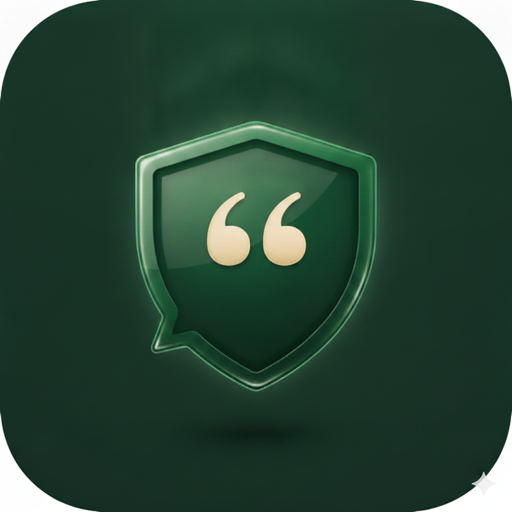

  

<h1 align="center">Dicho</h1>

  
  
  
  
  
  
  

On-device macOS dictation utility. Double-tap Ctrl, speak, and polished text is
inserted at your cursor in any app: Mail, Slack, Xcode, a browser, or a
terminal. No network calls, ever.

## 🚧 Roadmap

Dicho is at **v0** and actively evolving. Planned work:

- 🌍 **More languages.** Currently English (en-US) only.
- 🧑‍💻 **Stronger cleanup for code and terminal contexts.** The context hint
  helps prose most today, so sharpening the technical categories is next.
- 🎯 **Wider self-correction coverage,** recognizing more natural correction
  phrasings beyond the current explicit markers.

## ✨ Features

- ⚡️ **Press-to-talk.** Double-tap `Ctrl` to start, tap once to stop, `Esc` to
  cancel. Runs from the menu bar with no Dock icon.
- 🗣️ **On-device transcription** using Apple SpeechAnalyzer and
  SpeechTranscriber, entirely offline.
- 🪄 **AI cleanup pass.** Apple Foundation Models polish grammar, punctuation,
  and self-corrections into finished text.
- 🧭 **Context-aware.** A one-sentence hint about the frontmost app tunes the
  cleanup, for example preserving code identifiers or scene headings.
- 📋 **Inserts anywhere.** Synthetic paste drops text at your cursor in any app,
  falling back to the clipboard when an app blocks it.
- 🎛️ **Raw mode** bypasses cleanup for verbatim transcription, from the menu bar
  or Settings.
- 🔒 **Zero network.** No analytics, no telemetry, no cloud. Audio and text
  never leave your Mac.

## 🧰 Tech Stack

| Layer | Technology |
| --- | --- |
| Language | Swift 6 |
| UI | SwiftUI (Settings, Onboarding, HUD) + AppKit shell |
| Speech-to-text | Apple Speech (SpeechAnalyzer / SpeechTranscriber) |
| Text cleanup | Apple Foundation Models (on-device) |
| Audio capture | AVFoundation |
| Hotkey & insertion | CoreGraphics + ApplicationServices (CGEvent tap, synthetic paste) |
| Launch at login | ServiceManagement |
| Testing | Swift Testing |
| Platform | macOS 26+, Apple Silicon |

## 🚀 Getting Started

### Requirements

- macOS 26 or later
- Apple Silicon Mac
- Apple Intelligence enabled

### Build from source

Open `Dicho.xcodeproj` in Xcode 26+, select the **Dicho** scheme, and run.
There are no third-party dependencies and no package resolution step.

### Download

Dicho is currently at **v0.2** and in **limited testing with friends and
family**: a notarized, Developer ID-signed DMG is shared directly with testers,
with a public download to come later. Dicho ships outside the Mac App Store
because the sandbox prohibits the global event tap and synthetic paste the core
loop depends on. In the meantime, anyone can build from source using the steps
above.

### Permissions

Dicho requests three permissions on first launch, and an onboarding window walks
you through each one. The app is functional once all three are granted.

- **Microphone** for capturing your speech.
- **Accessibility** for monitoring the hotkey and inserting text via synthetic
  paste.
- **Speech model**, an on-device model downloaded through Apple's asset system.

## ⚙️ How It Works

1. **Trigger.** A global CGEvent tap sees the double-tap of `Ctrl` and starts a
   session.
2. **Capture.** AVFoundation records microphone audio into the in-memory
   pipeline.
3. **Transcribe.** Apple SpeechAnalyzer and SpeechTranscriber convert speech to
   text on-device.
4. **Clean up.** Apple Foundation Models refine the transcript (unless Raw mode
   is on), guided by a hint about the frontmost app.
5. **Insert.** The result is placed at your cursor via synthetic paste, and your
   clipboard is restored afterward.

## 🔒 Privacy

Dicho makes **no network calls**. All transcription (Apple SpeechAnalyzer /
SpeechTranscriber) and cleanup (Apple Foundation Models) runs entirely
on-device. Dictated audio and text never leave your Mac and are never persisted
or logged. Only your settings are saved, in `UserDefaults`. The one exception is
the operating system's own one-time download of the on-device speech model,
which macOS performs (not Dicho) through Apple's asset system.

## 🗣️ Dictation Tips

Dicho's cleanup pass is powered by Apple's on-device Foundation Models. The model
handles natural prose well but is most reliable when given explicit, deliberate
markers for self-corrections. Two correction phrases work consistently across all
apps:

- **"no wait"**: *"Let's meet Tuesday, no wait, Friday"* becomes *"Let's meet
  Friday."*
- **"correction"**: *"The meeting is Tuesday, correction, the meeting is
  Wednesday"* becomes *"The meeting is Wednesday."*

A third deliberate marker is also recognized in the prompt. It works in many
cases but less consistently than the two above:

- **"scratch that"**: *"Buy milk, scratch that, buy bread"* becomes *"Buy
  bread."*

Other natural self-corrections, such as a bare *"X, no Y"* or *"X, actually Y"*,
are not reliably detected by the current on-device model. If a correction isn't
applied, re-dictate with one of the markers above.

Cleanup is also context-aware: Dicho passes a one-sentence hint about the
frontmost app to the model (for example, *"this is a screenwriting app, preserve
scene headings"* or *"this is a code editor, preserve identifiers"*). The hint is
advisory. On the current on-device model the prose categories (messaging, email,
notes) see the strongest benefit, while the code and terminal hints are weaker.
You can bypass cleanup entirely with **Raw mode** in the menu-bar menu or
Settings.

## ⚠️ Known Limitations

- Secure input fields (for example, password fields and some terminal apps with
  secure input enabled) block synthetic paste, so text lands in your clipboard
  instead.
- Clipboard manager apps may briefly see the dictated text during the paste
  window before the clipboard is restored.
- English (en-US) only in v0.
- Some browser text areas (Gmail compose, Notion, Linear, etc.) don't expose the
  standard accessibility roles Dicho expects; in those cases the dictation lands
  on the clipboard for manual paste.

## 📄 License

© 2026 Carlos Ocampo. All rights reserved. This source is published for viewing
and portfolio purposes; it may not be used, copied, modified, or redistributed
without permission. See [LICENSE](LICENSE) for details.
